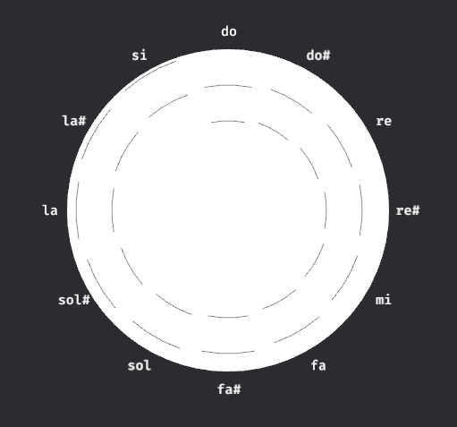
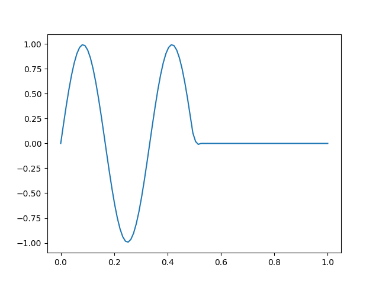

# What ?

An app to visualize melody and chords.

Right now, there are 2 ways to visualize chords:

- on a hour-like circle

- with vibrating strings, similar to that:

There may be more to come !

# Where ?

<https://rambip.github.io/note-circle>

# How ?

Made with love with [bevy](https://bevyengine.org/)
